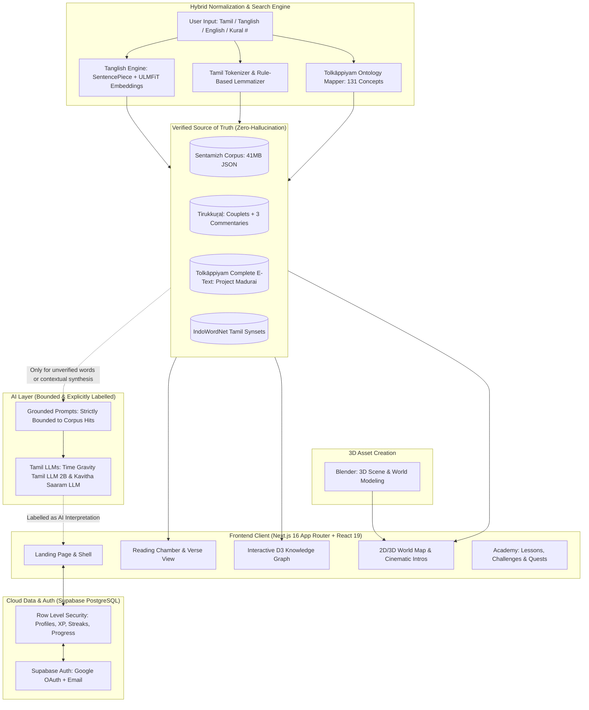
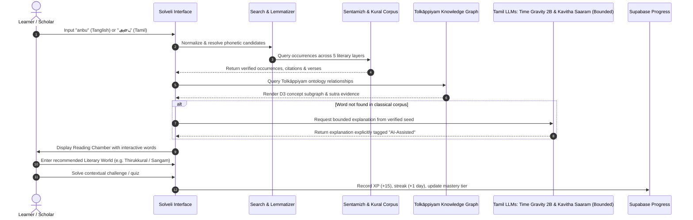

# சொல்வெளி உலகம் · Solveli World

> **"Every Tamil word has a world inside it."**  
> *“Every object you can walk up to in this world is a line someone actually wrote.”*

[](https://github.com/BLESSEDSAMUELES/Solveli-Ulagam)
[](https://nextjs.org/)
[](https://react.dev/)
[](https://www.typescriptlang.org/)
[](https://supabase.com/)
[](https://www.blender.org/)
[](https://huggingface.co/)
[](https://d3js.org/)

---

## 🏛️ Project Identity & Executive Summary

**Solveli World (சொல்வெளி உலகம்)** is a source-grounded Tamil literary exploration platform developed for **AUREX'26 (Track 03 — WordNet: Explore Tamil Words Across Literature and Context)** by **Team Solveli** from **Sri Sairam Engineering College, Chennai**.

### Team Solveli
- **Blessed Samueles N G**
- **Andrew Savio M**
- **Logesh E**

Solveli turns Tamil literary vocabulary from a static dictionary lookup into an evidence-backed, multi-era literary journey. At its core is a **WordNet-style semantic knowledge graph** connecting words to candidate senses, contextual occurrences, literary works, and authentic historical citations. 

The base system answers: *“What does this word mean here?”*  
Solveli World extends this to: *“Where and when does this word appear across two millennia of literary evidence?”*

```
   ┌─────────────────────────────────────────────────────────────────────────────────┐
   │                                  CORE EQUATION                                  │
   │  WORD ➔ CONTEXT ➔ TIME ➔ WORLD ➔ EVIDENCE ➔ LEARNING ➔ MASTERY ➔ DISCOVERY      │
   └─────────────────────────────────────────────────────────────────────────────────┘
```

---

## 🧭 The Core Problem & Opportunity

| Conventional Lookup Friction | The Solveli Solution |
| :--- | :--- |
| **Generic Definitions:** Flattens 2,000+ years of subtle literary nuance into modern dictionary glosses. | **Context-Specific Senses:** Ranks candidate meanings based on surrounding passage, poem genre (*Thinai*), and era. |
| **Distributed Occurrences:** Verses scattered across disparate manuscripts, books, and archives. | **Unified Sentamizh Corpus:** Over 41 MB of annotated classical verses indexed and queryable instantly. |
| **Weak Provenance & Citations:** Definitions rarely link back to author, meter, or verifiable verse lines. | **Unbroken Evidence Chain:** Every occurrence preserves work, author, period, line numbers, and original script. |
| **Flat Lexical Relations:** Hypernyms, hyponyms, and synonyms are trapped in paper lexicons. | **Interactive Knowledge Graph:** D3-powered Tolkāppiyam ontology visualizes semantic hierarchy and relationships. |
| **Engagement Gap:** One-off lookups fail to build long-term retention or cultural connection. | **Academy & Gamification:** XP, quests, streaks, hearts, and companions turn discovery into sustained learning. |

> [!IMPORTANT]
> **Scope Guardrail & Trust Equation:**  
> `Evidence ➔ Explanation ➔ Interaction. Never Interaction ➔ Invented Evidence.`  
> The 3D and cinematic worlds are experiential layers over verifiable truth—never a generic fantasy RPG. Every concept, character, and visual node is tethered to actual classical texts.

---

## 📐 System Architecture & Data Flow

Solveli separates verified lexical truth from AI assistance and presentation:



---

## 🔄 End-to-End Product Loop



---

## 🌟 Key Features

### 1. 🔍 Unified Multi-Modal Search & Reading Chamber
- **Tri-Lingual Input Resolution:** Search in pure Tamil script (`அன்பு`), colloquial Tanglish (`anbu`, `kalvi`, `kadhal`), English conceptual labels (`love`, `ethics`), or by exact Tirukkuṟaḷ number (`391`) / chapter name.
- **NLP for Tanglish:** Uses an 8,000-piece SentencePiece vocabulary with 400-dimensional ULMFiT embeddings precomputed for nearest phonetic neighbours, converting Tanglish into verified Tamil lemmas.
- **Sentence Analysis:** Paste full classical sentences (e.g. `அவன் அன்புடன் பேசினான்`) to extract constituent tokens, identify grammatical lemmas, and rank candidate senses in-context.
- **The Reading Chamber:** Read any Tirukkuṟaḷ couplet or Sangam verse with clickable words. Tap any individual word to instantly inspect its lexical world, occurrences, and etymology without leaving the text.

### 2. 🕸️ Verified Knowledge Model & WordNet Graph
- **Tolkāppiyam Ontology:** Built on 131 formal nodes covering *Eḻuttu* (Phonology/Letters), *Col* (Morphology/Syntax), and *Poruḷ* (Poetics, *Akam* inner emotion & *Puṟam* public life).
- **Interactive D3 Visualizer:** Explores parent-child concept hierarchies, thematic clusters, and cross-era relationships with real-time force-directed layouts.
- **Sutra Evidence Grounding:** Automatically cross-references nodes to exact Tolkāppiyam sutras with algorithmic relevance scoring.

### 3. 🗺️ 5 Immersive Literary Worlds
Each world represents an epoch in Tamil civilization with dedicated 3D models crafted in **Blender**, authentic color palettes, thematic framing, curated texts, and cinematic video introductions:

| World | Era / Span | Focus & Corpus | Visual Motif & Sub-zones |
| :--- | :--- | :--- | :--- |
| **Sangam** (சங்க உலகம்) | c. 300 BCE – 300 CE | Classical anthologies (*Eṭṭuttokai*, *Pattuppāṭṭu*, *Kuṟuntokai*, *Puṟanāṉūṟu*) | Open *Tiṇai* landscapes: Kuṟiñci, Mullai, Marutam, Neytal, Pālai |
| **Thirukkural** (குறள் உலகம்) | c. 300 – 600 CE | Thiruvalluvar’s masterwork on *Aṟam* (Virtue), *Poruḷ* (Wealth), and *Iṉpam* (Love) | Ordered stone hall; 3 classical commentaries (கலைஞர், மு.வ, சாலமன் பாப்பையா) |
| **Bhakti** (பக்தி உலகம்) | c. 600 – 900 CE | Śaiva & Vaiṣṇava devotional hymns (*Tēvāram*, *Tiruvācakam*, *Nālāyira Divya Prabandham*) | Sacred temple-precinct architecture; spiritual transcendence |
| **Grammar** (இலக்கண உலகம்) | Dating contested | *Tolkāppiyam* in three books: *Eḻuttatikāram*, *Collatikāram*, *Poruḷatikāram* | Classical academy of scribes, palm-leaf manuscripts (*Ōlaiccuvaṭi*) |
| **History & Epics** (வரலாற்று உலகம்) | c. 2nd – 6th Century CE | Twin narrative epics: *Cilappatikāram* and *Maṇimēkalai* | Ancient maritime ports (Puhar, Madurai), courts, trade, civic justice |

### 4. 🧑‍🤝‍🧑 Living Character Universe
Characters provide pedagogical continuity and narrative motivation; they never fabricate historical speech:
- **Learner Companions:**
  - **Yaazhini (யாழினி):** Explorer companion — warm, curious, and welcoming for newcomers.
  - **Valavan (வளவன்):** Learning companion — sharp, challenge-focused, and motivating for deep study.
- **Contextual Literary Guides:**
  - **Thiruvalluvar:** Wisdom for Life & ethics (*Tirukkuṟaḷ*).
  - **Avvaiyar:** Foundational wisdom & aphorisms (*Āttichūḍi*).
  - **Tolkappiyar:** The science and grammar of Tamil (*Tolkāppiyam*).
  - **Ilango Adigal:** Dramatic narrative & civic ethics (*Cilappatikāram*).
  - **Kambar:** Epic verse & poetic majesty (*Kamparāmāyaṇam*).
  - **U. V. Swaminatha Iyer (UVSA - தமிழ்த்தாத்தா):** Palm-leaf preservation, philology, and manuscript recovery.

### 5. 🎮 Meaningful Pedagogical Gamification
Gamification exists strictly to reward authentic learning:
- **XP Progression:** Earn XP through genuine study actions:
  - Discover a new word: `+20 XP`
  - Read a verified occurrence: `+10 XP`
  - Identify correct contextual meaning: `+15 XP`
  - Compare eras/contexts: `+25 XP`
  - Complete a quest / lesson / challenge: `+50` to `+100 XP`
- **4 Mastery Levels:** `Discovered` ➔ `Learning` ➔ `Familiar` ➔ `Mastered`.
- **Diamonds & Hearts:** Diamonds reward streaks and accomplishments; Hearts protect learners during challenge assessments without locking reading or reference access behind paywalls.
- **Daily Quests & Streaks:** Encourages sustained daily engagement with historical literature.

### 6. 🛡️ Trust Architecture & Dedicated Tamil LLMs
- **Specialized Tamil Intelligence:** Powered by **Time Gravity Tamil LLM 2B** and **Kavitha Saaram LLM** for nuanced classical comprehension, poetic interpretation, and contextual synthesis.
- **Strict Grounding:** The Tamil LLMs are invoked *only* when a query cannot be verified in the corpus or when generating contextual syntheses, strictly bounded by retrieved verse citations.
- **Prominent Labelling:** AI output is visually badged with a distinct bot indicator, accompanied by an explicit disclaimer: *“AI-assisted explanation — an interpretation, not literary evidence.”*
- **Contested Dating Transparency:** Dates are represented as scholarly ranges (e.g. `c. 300–600 CE`) rather than artificial, rigid historical absolutes.

---

## 💻 Tech Stack & Infrastructure

```
Frontend & 3D Assets           Backend & Data Engines         AI & Tamil Intelligence
┌───────────────────────┐      ┌────────────────────────┐     ┌───────────────────────┐
│ • Next.js 16.3.6      │      │ • Next.js Server Runt. │     │ • Time Gravity        │
│ • React 19.2.8        │      │ • Supabase PostgreSQL  │     │   Tamil LLM 2B        │
│ • TypeScript 5.0      │      │ • Row Level Security   │     │ • Kavitha Saaram LLM  │
│ • Blender (3D Models) │      │ • SentencePiece Token. │     │ • Supabase Auth       │
│ • D3.js 7.9 (Graph)   │      │ • ULMFiT Vector Embed. │     │   (Google OAuth/Email)│
│ • Lottie-Web 5.13     │      │ • Python Extraction    │     │ • PGlite (Local Tests)│
│ • Lucide Icons        │      │ • PyMuPDF (PDF Parser) │     │ • Project Madurai     │
│ • Modern Vanilla CSS  │      │ • Sentamizh Corpus     │     │ • Sentamizh Corpus    │
└───────────────────────┘      └────────────────────────┘     └───────────────────────┘
```

---

## 🗄️ Project Structure

```
Solveli-Ulagam/
├── README.md                      # Comprehensive project documentation & guide
├── LICENSE                        # Proprietary software license
├── THIRD_PARTY_NOTICES.md         # Open-source and third-party dataset credits
├── Tholkappiam.txt                # Complete Tolkāppiyam e-text (Project Madurai)
│
├── datasets/                      # Lexical data, mappings & extraction scripts
│   ├── Ontology.csv               # 131 Tolkāppiyam grammatical/literary concepts
│   ├── Query_Mapping.csv          # Canonical query-to-concept routing rules
│   ├── extract_thirukkural.py     # PDF-to-JSON extractor with glyph decoding
│   ├── tk_glyphs.py               # Custom Tamil font glyph decoders
│   └── tanglish/
│       ├── build_tanglish.py      # ULMFiT embeddings & neighbor precomputer
│       ├── tanglish.json          # Precomputed Tanglish vocabulary & neighbors
│       └── LICENSE-nlp-for-tanglish
│
├── sentamizh-corpus/              # Annotated Classical Tamil Verses (Apache-2.0)
│   ├── CITATION.cff               # Scholarly citation metadata
│   ├── LICENSE                    # Apache 2.0 full text
│   └── sentamizh_corpus.json      # 41.6 MB complete annotated corpus
│
└── web/                           # Next.js 16 Full-Stack Application
    ├── package.json               # Dependencies & scripts
    ├── next.config.ts             # Environment security & asset headers
    ├── tsconfig.json              # TypeScript configuration
    │
    ├── public/                    # Static assets & media
    │   ├── animations/            # Lottie animations for onboarding
    │   ├── bg/                    # High-resolution world backdrops
    │   ├── characters/            # Portrait & avatar WebP crops of guides/companions
    │   └── video/                 # Cinematic world entrance MP4 films
    │
    ├── supabase/                  # Database migrations & local verification
    │   ├── README.md              # Supabase setup & RLS architecture guide
    │   ├── migrations/
    │   │   ├── 20260923120000_solveli_schema.sql  # Tables, RLS, triggers, indexes
    │   │   └── 20260923120100_seed_catalog.sql     # Seed data: worlds, quests, guides
    │   └── tests/
    │       └── migrations.test.mjs                 # In-memory PGlite RLS & trigger test suite
    │
    └── src/
        ├── app/                   # Next.js App Router (pages & API routes)
        │   ├── page.tsx           # Cinematic landing page
        │   ├── onboarding/        # 5-step role, level, companion & guide selection
        │   ├── signin/ & signup/  # Authentication views
        │   ├── academy/           # Core Academy hub routes
        │   │   ├── search/        # Multi-modal search & word exploration
        │   │   ├── worlds/        # Zoomable interactive 5-world map
        │   │   ├── thirukkural/   # Complete Tirukkuṟaḷ with 3 commentaries
        │   │   ├── verse/         # Classical verse Reading Chamber
        │   │   ├── lessons/       # Structured modular Tamil lessons
        │   │   ├── challenges/    # Daily challenges & quizzes
        │   │   ├── guides/        # Guide profiles & wisdom cards
        │   │   ├── progress/      # XP, streak & mastery dashboard
        │   │   ├── library/       # Curated primary text catalog
        │   │   └── community/     # Topic boards, discussions & member posts
        │   └── api/               # Serverless API routes (search, KG, meaning, dev)
        ├── components/            # Reusable UI components & academy modules
        └── lib/                   # Business logic, corpus loader, D3 graph, auth & RLS
```

---

## ⚡ Quick Start & Installation

### Prerequisites
- **Node.js**: `v20.0.0` or higher
- **npm**: `v10.0.0` or higher
- **Python**: `3.10+` (optional, only if re-extracting Tirukkuṟaḷ or rebuilding Tanglish vectors)

### 1. Clone the Repository
```bash
git clone https://github.com/BLESSEDSAMUELES/Solveli-Ulagam.git
cd Solveli-Ulagam
```

### 2. Configure Environment Variables
Create a file named `.env` inside the `web/` folder:
```bash
# web/.env
SUPABASE_URL=https://your-project.supabase.co
SUPABASE_KEY=your-publishable-anon-key   # NEVER use service-role key
```

> [!NOTE]
> Solveli's `next.config.ts` validates that only publishable keys are exposed to the client. No service-role key is ever bundled or required.

### 3. Setup the Database (Supabase)
Apply the SQL migrations located in `web/supabase/migrations/` via the Supabase Dashboard SQL Editor or Supabase CLI:
1. `20260923120000_solveli_schema.sql` (Tables, triggers, RLS policies)
2. `20260923120100_seed_catalog.sql` (Catalog of worlds, lessons, guides, quests)

Validate your database setup locally with in-memory Postgres:
```bash
cd web
npm run test:db
```

### 4. Install Dependencies & Launch
```bash
cd web
npm install
npm run dev
```
Open **[http://localhost:3000](http://localhost:3000)** in your browser.

---

## 🎯 3-to-5 Minute Judge Demo Script

| Time | Step | Action & Key Talking Point |
| :---: | :--- | :--- |
| **0:00 - 0:45** | **The Problem & Landing** | Open `http://localhost:3000`. Show the cinematic entrance and state the thesis: *“Tamil words have 2,000+ years of evolution; modern dictionaries flatten them into one gloss. Solveli connects words to living evidence.”* |
| **0:45 - 1:30** | **Tanglish & Multi-Modal Search** | Type `anbu` into search. Show the Tanglish engine resolve `anbu` ➔ `அன்பு` using precomputed SentencePiece/ULMFiT vectors. Point out how occurrences across Sangam, Bhakti, and Didactic literature populate instantly. |
| **1:30 - 2:30** | **Knowledge Graph & Sutra Evidence** | Expand the **Tolkāppiyam Knowledge Graph**. Demonstrate the dynamic D3 force layout connecting *Anbu* to *Akam* poetics and *Thinai* landscapes. Show the sutra reference verified directly from `Tholkappiam.txt`. |
| **2:30 - 3:30** | **The Reading Chamber & Kural** | Navigate to Kural 391 (*கற்க கசடற*). Highlight the Reading Chamber: tap any word to reveal its other occurrences across classical poetry. View commentaries from Kalaignar, Mu. Va, and Solomon Pappaiah side-by-side. |
| **3:30 - 4:15** | **Cinematic World & Challenges** | Enter the **Sangam World** with its cinematic intro film. Show the five *Tiṇai* interactive regions. Complete a quick evidence-backed context challenge and watch XP, streak, and mastery tier update in real-time. |
| **4:15 - 5:00** | **The Pitch Closing** | Conclude with the team's core principle: *“Every object you can walk up to in this world is a line someone actually wrote. Solveli turns Tamil vocabulary from something you look up into something you explore, verify, and master.”* |

---

## ❓ Frequently Asked Judge Questions

<details>
<summary><b>1. Is Solveli World just a 3D video game?</b></summary>
<br>
<b>No.</b> The WordNet lexical graph and verified corpus are the core intellectual property. The 3D models and environments—crafted in <b>Blender</b>—and cinematic entrances are experiential visualization layers over the exact same source of truth. If WebGL or graphics acceleration is unavailable, Solveli gracefully degrades to a 100% accessible 2D graph and reading interface with zero loss of academic rigor.
</details>

<details>
<summary><b>2. How do you prevent LLM hallucinations?</b></summary>
<br>
Through <b>strict retrieval-first bounding</b>. The system never asks an LLM to recall classical Tamil facts from memory. The engine first queries the verified 41 MB Sentamizh Corpus and Tolkāppiyam text. When generating contextual syntheses with <b>Time Gravity Tamil LLM 2B</b> and <b>Kavitha Saaram LLM</b>, the models receive verified verses as mandatory citations in their prompts and are strictly bounded by corpus hits. Any AI-generated text is explicitly badged with a warning.
</details>

<details>
<summary><b>3. What makes Solveli novel compared to existing Tamil dictionaries?</b></summary>
<br>
Existing tools (like Tamil Virtual Academy or agarathi.com) provide static, 1-to-1 modern definitions. Solveli is the first to combine:
1. Cross-era attestation timelines (seeing how word meaning shifted from Sangam to Bhakti).
2. Phonetic Tanglish subword matching via NLP embeddings.
3. Formal Tolkāppiyam ontological knowledge graphs.
4. Interactive Reading Chambers with full manuscript provenance.
</details>

---

## 📊 AUREX'26 Track 03 Alignment Matrix

| Track 03 Requirement | Solveli Implementation | Implementation Details |
| :--- | :--- | :--- |
| **Clickable Tamil Words** | Reading Chamber | Every word in any couplet or verse is an active link that launches instant cross-text lookup. |
| **Word Search** | Hybrid Lexical Engine | Supports pure Tamil script, full sentences, Tanglish phonetic input, and English concepts. |
| **Occurrences Across Texts** | Sentamizh Corpus Search | Instant queries across 41.6 MB of curated, annotated classical Tamil literature. |
| **Contextual Meanings** | Context & Era Ranker | Ranks candidate meanings based on surrounding words, literary layer, and poetic genre (*Thinai*). |
| **Literary References** | Full Provenance Cards | Every quote displays poet/author, work title, meter/layer, and canonical line numbers. |
| **Related Words** | WordNet & Ontology Graph | Navigates hypernyms, hyponyms, and synonyms via D3 force-directed visualizations. |
| **Timeline Exploration** | 5 Epoch Worlds | Allows scholars and students to observe semantic shift and attestation across centuries. |
| **Gamification** | Solveli Academy | XP, badges, daily streaks, quests, and 4-tier mastery to inspire lifelong engagement. |
| **Character Experience** | Guides & Companions | Pedagogical interaction with historical poets (Thiruvalluvar, Tolkappiyar, Avvaiyar). |

---

## 📜 Intellectual Property & Third-Party Notices

- **Solveli Proprietary Core:** The application code, knowledge graph mapping architecture, UI design, and pedagogical engine are proprietary works © 2026 Team Solveli (Blessed Samueles N G, Andrew Savio M, Logesh E). All rights reserved.
- **3D Modeling & Worlds:** 3D models and spatial environments crafted using **Blender**.
- **Sentamizh Corpus:** Used under the **Apache License 2.0** (see `sentamizh-corpus/LICENSE`).
- **Tolkāppiyam Text:** Distributed under the preservation terms of **Project Madurai** (1998–2024).
- **Tanglish NLP Engine:** Derived from `goru001/nlp-for-tanglish` under the **MIT License**.
- **Onboarding Animations:** Used under the **Lottie Simple License** (see `web/public/animations/onboarding/LICENSE.md`).
- For complete third-party credits and notices, see [THIRD_PARTY_NOTICES.md](THIRD_PARTY_NOTICES.md).

---

<div align="center">
  <sub>Built with passion for Tamil literature · Developed for AUREX'26 Track 03 (WordNet)</sub><br>
  <sub><b>Team Solveli · Sri Sairam Engineering College, Chennai</b></sub>
</div>
